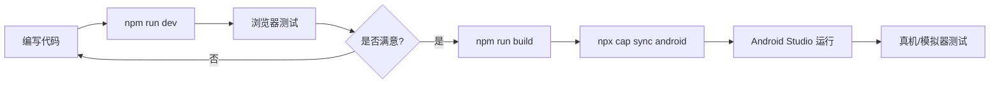

# 📱 文须记 - Android 平台部署指南

## 📋 目录

- [前置要求](#前置要求)
- [环境配置](#环境配置)
- [快速开始](#快速开始)
- [开发流程](#开发流程)
- [常见问题](#常见问题)
- [命令参考](#命令参考)

---

## 🔧 前置要求

在开始之前，请确保你的开发环境已安装以下工具：

### 必需软件

1. **Node.js** (v18 或更高版本)
   - 下载地址：https://nodejs.org/
   - 验证安装：`node --version`

2. **Android Studio** (最新稳定版)
   - 下载地址：https://developer.android.com/studio
   - 包含 Android SDK 和模拟器

3. **Java JDK** (JDK 17 推荐)
   - 下载地址：https://adoptium.net/
   - 验证安装：`java --version`

### 可选工具

- **Git** - 用于版本控制
- **Android 真机** - 用于真机测试（需启用开发者模式）

---

## ⚙️ 环境配置

### 1. 配置 Android SDK

在 Android Studio 中：
1. 打开 `Tools` → `SDK Manager`
2. 确保安装了以下组件：
   - Android SDK Platform (API 33 或更高)
   - Android SDK Build-Tools
   - Android SDK Platform-Tools
   - Android Emulator

### 2. 配置环境变量

#### Windows (PowerShell)
```powershell
# 添加到系统环境变量
$env:ANDROID_HOME = "C:\Users\你的用户名\AppData\Local\Android\Sdk"
$env:Path += ";$env:ANDROID_HOME\platform-tools"
$env:Path += ";$env:ANDROID_HOME\tools"
```

#### macOS/Linux (Bash/Zsh)
```bash
export ANDROID_HOME=$HOME/Library/Android/sdk
export PATH=$PATH:$ANDROID_HOME/platform-tools
export PATH=$PATH:$ANDROID_HOME/tools
```

### 3. 配置 API 密钥

创建 `.env.local` 文件（如果还没有）：
```env
VITE_GEMINI_API_KEY=你的_Google_AI_API_密钥
```

---

## 🚀 快速开始

### 方法一：使用自动化脚本（推荐）

#### Windows (PowerShell)
```powershell
# 同步并生成 Android 资源
.\sync-android.ps1
```

#### macOS/Linux (Bash)
```bash
# 同步并生成 Android 资源
./sync-android.sh
```

脚本会自动执行：
1. ✅ 安装依赖
2. ✅ 构建 Web 应用
3. ✅ 同步到 Android 平台
4. ✅ 打开 Android Studio

### 方法二：手动执行

```bash
# 1. 安装依赖
npm install

# 2. 构建 Web 应用
npm run build

# 3. 同步到 Android 平台
npx cap sync android

# 4. 打开 Android Studio
npx cap open android
```

---

## 💻 开发流程

### 日常开发

1. **在浏览器中开发**（推荐用于快速迭代）
   ```bash
   npm run dev
   ```
   访问 `http://localhost:5173` 进行开发

2. **修改代码后同步到 Android**
   ```bash
   # 使用自动化脚本
   ./sync-android.sh  # 或 sync-android.ps1
   
   # 或手动执行
   npm run build
   npx cap sync android
   ```

3. **在 Android Studio 中运行**
   - 点击绿色 ▶️ 运行按钮
   - 或使用快捷键 `Shift + F10`

### 完整开发周期



---

## 📱 在 Android Studio 中运行

### 使用模拟器

1. **创建虚拟设备**
   - 点击 `Device Manager` (设备管理器)
   - 点击 `Create Device` (创建设备)
   - 选择设备型号（推荐：Pixel 6）
   - 选择系统镜像（推荐：API 33 或更高）
   - 完成创建

2. **启动模拟器**
   - 在 `Device Manager` 中点击 ▶️ 启动按钮

3. **运行应用**
   - 确保顶部工具栏选中了模拟器
   - 点击绿色 ▶️ 运行按钮

### 使用真机

1. **启用开发者模式**
   - 进入手机 `设置` → `关于手机`
   - 连续点击 `版本号` 7 次

2. **启用 USB 调试**
   - 进入 `设置` → `开发者选项`
   - 开启 `USB 调试`

3. **连接设备**
   - 使用 USB 线连接手机到电脑
   - 手机上允许 USB 调试授权

4. **验证连接**
   ```bash
   adb devices
   ```
   应该能看到你的设备列表

5. **运行应用**
   - 在 Android Studio 顶部选择你的设备
   - 点击绿色 ▶️ 运行按钮

---

## 🔍 常见问题

### Q1: Gradle 同步失败

**解决方案：**
1. 检查网络连接
2. 在 Android Studio 中：`File` → `Invalidate Caches` → `Invalidate and Restart`
3. 删除 `android/.gradle` 文件夹后重新同步

### Q2: 应用无法连接到 API

**解决方案：**
1. 确保 `.env.local` 文件存在且包含正确的 API 密钥
2. 检查 `capacitor.config.ts` 中的配置
3. 在 Android 中，确保 `AndroidManifest.xml` 包含网络权限：
   ```xml
   <uses-permission android:name="android.permission.INTERNET" />
   ```

### Q3: 修改代码后应用没有更新

**解决方案：**
1. 确保执行了 `npm run build`
2. 确保执行了 `npx cap sync android`
3. 在 Android Studio 中清理项目：`Build` → `Clean Project`
4. 重新运行应用

### Q4: Android Studio 找不到设备

**解决方案：**
1. 检查 USB 连接
2. 确保手机已启用 USB 调试
3. 运行 `adb kill-server` 然后 `adb start-server`
4. 重新连接设备

### Q5: 构建失败 - "SDK location not found"

**解决方案：**
1. 在 `android` 目录下创建 `local.properties` 文件
2. 添加以下内容（根据你的实际路径修改）：
   ```properties
   sdk.dir=C\:\\Users\\你的用户名\\AppData\\Local\\Android\\Sdk
   ```

---

## 📚 命令参考

### NPM 脚本

| 命令 | 说明 |
|------|------|
| `npm install` | 安装项目依赖 |
| `npm run dev` | 启动开发服务器（浏览器） |
| `npm run build` | 构建生产版本 |
| `npm run preview` | 预览生产构建 |

### Capacitor 命令

| 命令 | 说明 |
|------|------|
| `npx cap sync android` | 同步 Web 资源到 Android 项目 |
| `npx cap open android` | 在 Android Studio 中打开项目 |
| `npx cap run android` | 构建并运行到连接的设备 |
| `npx cap copy android` | 仅复制 Web 资源（不更新插件） |
| `npx cap update android` | 更新 Capacitor Android 平台 |

### ADB 命令

| 命令 | 说明 |
|------|------|
| `adb devices` | 列出连接的设备 |
| `adb logcat` | 查看设备日志 |
| `adb install app.apk` | 安装 APK 文件 |
| `adb uninstall com.yourcompany.wenxuji` | 卸载应用 |

---

## 🏗️ 项目结构

```
WenxuApp/
├── android/                 # Android 原生项目
│   ├── app/
│   │   └── src/main/
│   │       ├── assets/     # Web 资源（自动生成）
│   │       └── AndroidManifest.xml
│   └── build.gradle
├── components/             # React 组件
├── services/              # 服务层
├── dist/                  # 构建输出（自动生成）
├── App.tsx               # 主应用组件
├── capacitor.config.ts   # Capacitor 配置
├── package.json          # 项目依赖
├── sync-android.sh       # 同步脚本 (macOS/Linux)
├── sync-android.ps1      # 同步脚本 (Windows)
└── ANDROID_DEPLOY.md     # 本文档
```

---

## 🔐 安全注意事项

1. **不要提交 API 密钥**
   - `.env.local` 已在 `.gitignore` 中
   - 永远不要将 API 密钥硬编码到代码中

2. **生产环境配置**
   - 使用环境变量管理敏感信息
   - 考虑使用后端代理来保护 API 密钥

3. **应用签名**
   - 发布到 Google Play 前需要配置签名密钥
   - 妥善保管 keystore 文件

---

## 📦 发布到 Google Play

### 1. 生成签名密钥

```bash
keytool -genkey -v -keystore wenxuji-release.keystore -alias wenxuji -keyalg RSA -keysize 2048 -validity 10000
```

### 2. 配置签名

在 `android/app/build.gradle` 中添加签名配置

### 3. 构建 Release APK

在 Android Studio 中：
1. `Build` → `Generate Signed Bundle / APK`
2. 选择 `APK`
3. 选择你的 keystore 文件
4. 输入密码和别名
5. 选择 `release` 构建类型

### 4. 上传到 Google Play Console

访问 https://play.google.com/console 并按照指引上传 APK

---

## 🆘 获取帮助

- **Capacitor 文档**: https://capacitorjs.com/docs
- **Android 开发文档**: https://developer.android.com/docs
- **React 文档**: https://react.dev/

---

## 📝 更新日志

### v1.0.0 (2025-12-03)
- ✅ 初始 Android 平台支持
- ✅ 添加自动化同步脚本
- ✅ 完善部署文档

---

**祝你开发顺利！🚀**
